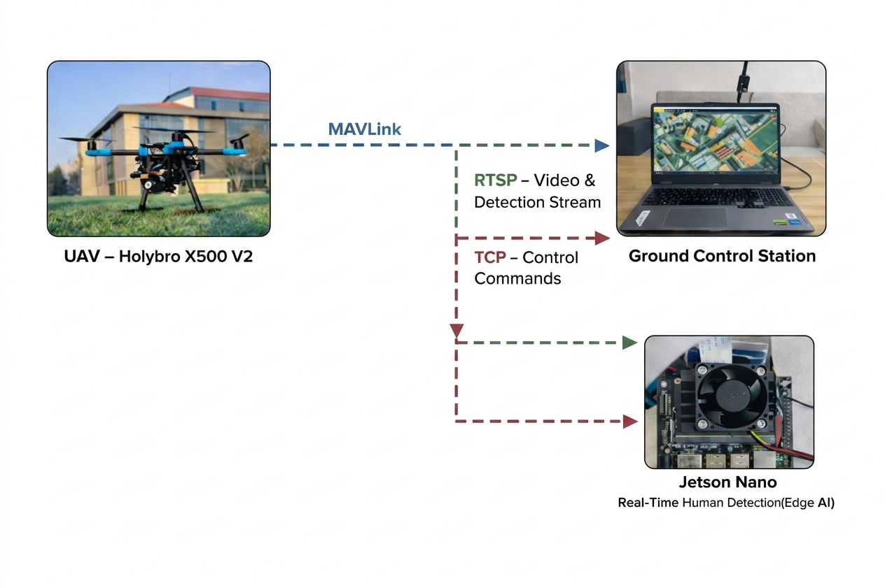
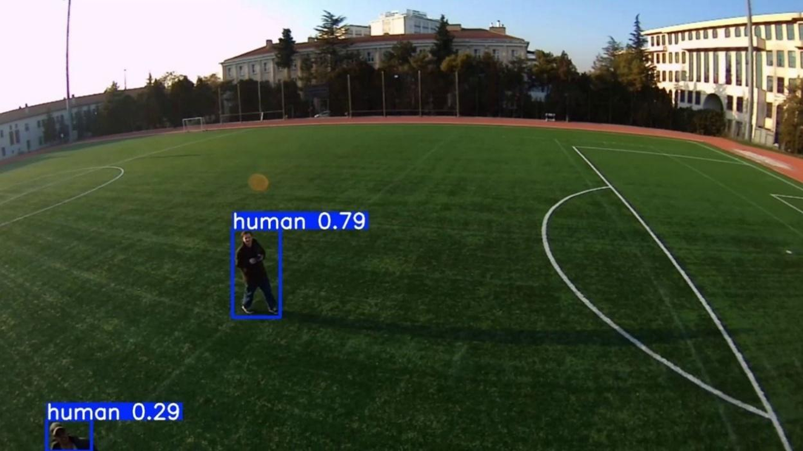
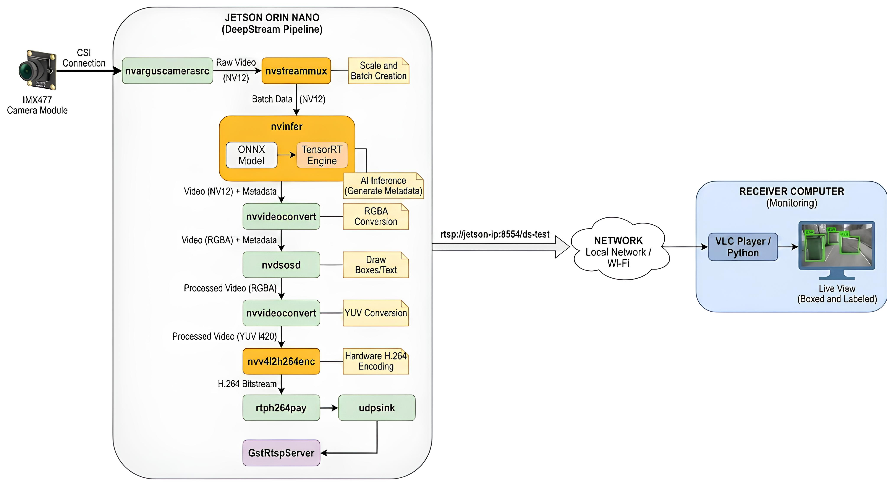

<div align="center">

# AI-Powered UAV System for Rapid Human Detection in Search & Rescue

**Real-time onboard human detection · Jetson Nano · YOLOv11n · TensorRT · DeepStream/RTSP deployment workflow**

[](https://python.org)
[](https://pytorch.org)
[](https://github.com/ultralytics/ultralytics)
[](https://developer.nvidia.com/embedded/jetson-nano)
[](https://developer.nvidia.com/deepstream-sdk)
[](LICENSE)
[](https://gazi.edu.tr)

</div>

---

> **Bachelor's thesis project** — Gazi University, Faculty of Technology, Department of Electrical & Electronics Engineering, January 2026  
> **Authors:** Muhammed Ali Yıldırım, Mohamedou Mohamedhen Vall  
> **Advisor:** Assoc. Prof. Dr. Ayşe Demirhan

---

## Demo

<div align="center">

| Hardware — Holybro X500 V2 on the field | Live detection — Gazi University campus |
|:---:|:---:|
|  |  |

<em>Real UAV field footage — YOLOv11n detecting humans at varying altitudes with bounding boxes and confidence scores streamed to the ground station.</em>

</div>

---

## Overview

This repository presents an **end-to-end UAV-based real-time human detection system** designed for search-and-rescue (SAR) scenarios.

The system uses an onboard **IMX477 RGB camera** and an **NVIDIA Jetson Nano 4GB edge device** to process aerial video, detect the `human` class with YOLO-based object detection models, and provide annotated video output to the ground control station for operator monitoring.

The key design principle is **operator decision support**.

The AI pipeline detects candidate human targets, while the human operator performs the final confirmation. Autonomous flight control, automatic target following, and direct AI-based UAV control are intentionally outside the scope of this work.

### Key Highlights

- Full UAV hardware and AI software integration
- Holybro X500 V2 UAV platform with Pixhawk 6C flight controller
- Jetson Nano-based onboard human detection workflow
- IMX477 RGB camera integration
- YOLOv8n and YOLOv11n comparison on the curated PROJECT dataset
- Final YOLOv11n model selected based on quantitative evaluation
- TensorRT and DeepStream-based Jetson Nano deployment workflow
- RTSP-based ground-station monitoring using VLC Player
- Real UAV field validation at Gazi University campus

---

## System Architecture

<div align="center">



<br>

<em>Overall UAV system architecture showing the relationship between the Holybro X500 V2 UAV platform, Jetson Nano onboard AI unit, RTSP-based video and detection stream, and the ground control station.</em>

</div>

The system is divided into two independent subsystems:

1. **Flight-control subsystem**
2. **AI perception and streaming subsystem**

```text
IMX477 Camera
     │
     ▼
Jetson Nano 4GB
  ├─ Frame acquisition
  ├─ YOLOv11n human detection
  ├─ TensorRT FP16 deployment workflow
  ├─ Bounding-box and confidence-score overlay
  └─ RTSP-based video output
     │
     ▼
Ground Control Station
  ├─ Live annotated video monitoring
  └─ QGroundControl for flight telemetry

Flight control: Pixhawk 6C ← RC operator
AI subsystem: Independent perception unit with no flight-control authority
```

The AI and flight-control subsystems are **deliberately decoupled**.

The Jetson Nano is used as an independent perception and streaming unit. It does **not** send flight-control commands to the Pixhawk 6C. This separation prevents the detection pipeline from compromising flight safety and keeps the system modular.

> **Note:** The TCP/control-related path shown in the architecture diagram refers to Jetson-side communication or monitoring/configuration flow. It does not represent autonomous flight-control authority from the AI subsystem to the Pixhawk flight controller.

---

## Hardware

| Component | Specification |
|---|---|
| UAV frame | Holybro X500 V2 quadcopter platform |
| Flight controller | Pixhawk 6C + PX4 firmware |
| Motors | Holybro 2216 KV920 brushless DC motors, CW/CCW configuration |
| ESCs | BLHeli_S 20A ESCs |
| Edge compute | NVIDIA Jetson Nano 4GB Developer Kit |
| Carrier board | Waveshare carrier board |
| Camera | IMX477 RGB camera module |
| Battery | Profuse 8000 mAh 65C 4S LiPo |
| Power regulation | Dedicated 5A UBEC for Jetson Nano |
| GPS | M10 GPS module |
| RC transmitter | FrSky Taranis QX7 ACCESS |
| RC receiver | FrSky XM+ |
| Ground control software | QGroundControl |
| RTSP viewer | VLC Player |

The UAV is manually operated. The AI subsystem is used only for real-time human detection and visual decision support.

---

## Results

### PROJECT Dataset — Final Model Comparison

The **PROJECT dataset** was created by selecting, filtering, cleaning, and reorganizing samples from the public **SARD** and **WiSARD** datasets for the target UAV-based search-and-rescue human detection scenario.

SARD was used as a task-focused aerial human detection source. RGB-only WiSARD samples were selectively included to improve environmental diversity such as forested backgrounds, partial occlusion, scale variation, and complex terrain.

| Split | Images |
|---|---:|
| Train | 13,856 |
| Validation | 3,959 |
| Test | 1,979 |
| **Total** | **19,794** |

### Final comparison on PROJECT dataset

| Model | Precision | Recall | mAP@0.5 | mAP@0.5:0.95 |
|---|---:|---:|---:|---:|
| YOLOv8n | 0.8997 | 0.7953 | 0.8433 | 0.4013 |
| **YOLOv11n** | **0.9109** | **0.8065** | **0.8694** | **0.4481** |

YOLOv11n outperformed YOLOv8n across the reported PROJECT dataset metrics.

The largest improvement was observed in `mAP@0.5:0.95`, where YOLOv11n increased the score from `0.4013` to `0.4481`. This corresponds to `+0.0468` absolute points, or approximately `+11.7%` relative improvement over YOLOv8n.

This improvement is important for aerial SAR scenarios because stricter IoU thresholds better reflect bounding-box localization quality, especially for small or partially visible human targets.

### Full benchmark across datasets and configurations

<details>
<summary>Click to expand full benchmark table</summary>

| Dataset | Model | Aug. | Precision | Recall | mAP@0.5 | mAP@0.5:0.95 |
|---|---|---|---:|---:|---:|---:|
| SARD | YOLOv8n | No | 0.931 | 0.928 | 0.945 | 0.659 |
| SARD | YOLOv8n | Yes | 0.933 | 0.927 | 0.947 | 0.660 |
| SARD | YOLOv11n | No | 0.910 | 0.920 | 0.941 | 0.640 |
| SARD | YOLOv11n | Yes | 0.926 | 0.932 | 0.949 | 0.660 |
| WiSARD | YOLOv8n | No | 0.933 | 0.834 | 0.871 | 0.464 |
| WiSARD | YOLOv8n | Yes | 0.939 | 0.845 | 0.880 | 0.478 |
| WiSARD | YOLOv11n | No | 0.917 | 0.849 | 0.871 | 0.466 |
| WiSARD | YOLOv11n | Yes | 0.932 | 0.847 | 0.879 | 0.481 |
| **PROJECT** | **YOLOv8n** | **Yes** | **0.8997** | **0.7953** | **0.8433** | **0.4013** |
| **PROJECT** | **YOLOv11n** | **Yes** | **0.9109** | **0.8065** | **0.8694** | **0.4481** |

</details>

---

## Field Test Results

Field tests were conducted at the Gazi University campus using real UAV footage.

The goal of field testing was to qualitatively evaluate whether the final YOLOv11n model could detect humans under realistic aerial viewing conditions.

The tests included:

- Different UAV altitude and distance conditions
- Small target scale in aerial images
- Partially visible human targets
- Targets near image boundaries
- Real outdoor lighting and background conditions

<div align="center">

| Detection at medium altitude | Detection with partial visibility |
|:---:|:---:|
|  |  |

</div>

The field tests qualitatively confirmed that the selected YOLOv11n model could detect human targets across different target scales and challenging visibility conditions.

The system is intended to support the operator by highlighting candidate targets, not to replace human confirmation.

---

## DeepStream and RTSP Pipeline

<div align="center">



<br>

<em>DeepStream-based real-time inference and RTSP streaming pipeline. The IMX477 camera stream is processed on the Jetson Nano, passed through the TensorRT inference stage, annotated with bounding boxes, encoded, and transmitted to the receiver computer over RTSP for live monitoring.</em>

</div>

The deployment workflow targets an NVIDIA Jetson Nano with an IMX477 CSI camera.

The high-level deployment flow is:

```text
YOLOv11n best.pt
        │
        ▼
ONNX export
        │
        ▼
TensorRT engine generation on Jetson Nano
        │
        ▼
DeepStream-based inference pipeline
        │
        ▼
RTSP output
        │
        ▼
Ground station monitoring with VLC Player
```

The processed stream was viewed at the ground station using **VLC Player**.

No formal FPS or end-to-end latency measurement was recorded. Therefore, this repository does not report numerical FPS or latency values.

---

## Repository Structure

```text
ai-search-and-rescue-drone-system/
│
├── assets/
│   ├── diagram.png
│   ├── ds_diagram.jpg
│   ├── hardware/
│   │   └── drone_field.jpg
│   └── field_test/
│       ├── detection_sample_1.png
│       ├── detection_sample_2.png
│       └── detection_sample_3.png
│
├── dataset/
│   └── README_dataset.md
│
├── docs/
│   ├── field_tests.md
│   ├── hardware_bom.md
│   ├── jetson_deployment.md
│   └── system_architecture.md
│
├── models/
│   └── README.md
│
├── training/
│   └── README_training.md
│
├── .gitignore
├── CITATION.cff
├── LICENSE
├── README.md
└── requirements.txt
```

> This public repository focuses on documentation, training configuration, model metadata, dataset description, field-test evidence, and system-level deployment notes. Device-specific DeepStream runtime configuration files are not included in the current repository version.

---

## Quickstart

### 1 — Install dependencies

```bash
pip install -r requirements.txt
```

The main development and training environment used in this project was Google Colab.

For Jetson Nano deployment, use the JetPack-compatible Python, CUDA, TensorRT, and DeepStream versions provided by the NVIDIA JetPack ecosystem.

### 2 — Run inference on an image or video

The trained model weights are not included in this repository by default.

If you have access to the trained `best.pt` file, place it under a local path of your choice and update the model path below.

```python
from ultralytics import YOLO

model = YOLO("path/to/best.pt")

results = model.predict(
    source="your_video.mp4",
    conf=0.40,
    imgsz=640,
    save=True
)
```

> **Recommended confidence range: 0.40–0.45**  
> This range was selected based on confidence-threshold analysis and SAR-specific recall requirements. Higher thresholds may reduce false positives but can increase the risk of missing small or partially visible human targets.

### 3 — Export to ONNX / TensorRT

```python
from ultralytics import YOLO

model = YOLO("path/to/best.pt")

# ONNX export
model.export(format="onnx", imgsz=640)

# TensorRT FP16 export
# Run this on the target NVIDIA platform whenever possible.
model.export(format="engine", imgsz=640, half=True)
```

TensorRT engines are hardware- and software-environment dependent. For reproducibility, the TensorRT `.engine` file should be generated on the target Jetson device.

### 4 — Training from scratch

The final YOLOv11n model was trained in **Google Colab** using an **NVIDIA A100 GPU**.

```python
from ultralytics import YOLO
import os

os.environ["WANDB_MODE"] = "disabled"

model = YOLO("yolov11n.pt")

results = model.train(
    data=str(yaml_path),
    epochs=100,
    imgsz=640,
    batch=32,
    patience=20,
    optimizer="SGD",
    lr0=0.01,
    lrf=0.01,
    weight_decay=0.0005,
    device=0,
    workers=2,
    cache=True,
    hsv_h=0.015,
    hsv_s=0.7,
    hsv_v=0.4,
    flipud=0.0,
    fliplr=0.5,
    mosaic=1.0,
    mixup=0.1,
    label_smoothing=0.0,
)
```

Validation and test sets were kept separate from the training split to preserve unbiased evaluation.

---

## Dataset

### Public Dataset Sources

| Dataset | Link | Role in this project |
|---|---|---|
| SARD — Search and Rescue Dataset | https://www.kaggle.com/datasets/nikolasgegenava/sard-search-and-rescue | Task-focused aerial human detection source |
| WiSARD — Wilderness Search and Rescue Dataset | https://sites.google.com/uw.edu/wisard/ | Additional environmental diversity through selected RGB samples |
| WiSARD Paper | https://arxiv.org/abs/2309.04453 | Research paper describing the WiSARD dataset |

Please refer to the original dataset pages and their usage terms before redistribution or commercial use.

### PROJECT Dataset

The PROJECT dataset is not a separate dataset collected from scratch.

It is a task-specific curated dataset created from SARD and selected RGB samples from WiSARD for the UAV-based search-and-rescue human detection scenario.

The preparation process included:

- Selecting relevant RGB samples from SARD and WiSARD
- Excluding thermal/LWIR images because the deployed UAV system uses an RGB camera
- Filtering samples based on search-and-rescue scenario relevance
- Checking image-label matching
- Validating YOLO-format annotations
- Removing invalid or unsuitable samples
- Creating train, validation, and test splits
- Applying augmentation only during the training process

The curated PROJECT dataset is not directly redistributed in this repository. Researchers or students who would like to reproduce the experiments or examine the curated version can contact the author.

Contact: [muali.yldrm@gmail.com](mailto:muali.yldrm@gmail.com)

---

## Training Environment

| Component | Version / Status |
|---|---|
| Python | 3.12.12 |
| PyTorch | 2.8.0+cu126 |
| Ultralytics | 8.3.0 |
| OpenCV | 4.12 |
| Albumentations | 2.0.8 |
| Roboflow | Not used |
| Training platform | Google Colab |
| GPU | NVIDIA A100 |

---

## Jetson Nano Deployment Environment

| Component | Version / Status |
|---|---|
| Edge device | NVIDIA Jetson Nano 4GB Developer Kit |
| Carrier board | Waveshare carrier board |
| JetPack | 4.6.4 |
| DeepStream SDK | 6.0.1 |
| TensorRT | Exported on the Jetson Nano deployment environment |
| Camera | IMX477 |
| RTSP monitoring | Tested |
| Ground station viewer | VLC Player |
| FPS / latency measurement | Not formally measured |

The ONNX model was available, and the TensorRT engine was generated on the Jetson Nano deployment environment.

---

## Model Availability

The final YOLOv11n model file is:

```text
best.pt
```

The trained weights are not included in this repository by default. They may be shared upon reasonable academic request.

Available formats:

| Format | Status |
|---|---|
| PyTorch `.pt` | Available upon reasonable academic request |
| ONNX `.onnx` | Exported, not included in this repository by default |
| TensorRT `.engine` | Generated on the Jetson Nano deployment environment |

---

## Limitations

- The system detects candidate human targets but does not autonomously control the UAV.
- The model was trained on RGB data only; thermal/LWIR detection is outside the current repository scope.
- Detection performance can degrade under extreme altitude, motion blur, heavy occlusion, severe lighting changes, or very small target pixel area.
- FPS and end-to-end latency were not formally measured.
- DeepStream and TensorRT deployment may require platform-specific adjustments on Jetson Nano.
- The PROJECT dataset is curated from public sources and is not redistributed directly in this repository.

---

## Future Work

- Add portable DeepStream configuration files for Jetson Nano.
- Evaluate newer Jetson hardware for higher FPS and lower latency.
- Add formal FPS and end-to-end latency measurements.
- Add RGB-thermal multimodal detection support.
- Extend the pipeline with geotagged detections and map-based operator alerts.
- Improve small-target performance through tiling, higher input size, or multi-scale inference.

---

## Citation

If you use this work, please cite:

```bibtex
@thesis{yildirim_mohamedhen2026sar,
  title      = {AI-Powered Drone System for Rapid Reconnaissance and Verification in Search and Rescue},
  author     = {Yıldırım, Muhammed Ali and Mohamedhen Vall, Mohamedou},
  year       = {2026},
  month      = {January},
  school     = {Gazi University, Faculty of Technology},
  type       = {Bachelor's Thesis},
  department = {Electrical and Electronics Engineering}
}
```

This repository also includes a [`CITATION.cff`](CITATION.cff) file for GitHub citation support.

---

## References

- Sambolek, S. and Ivašić-Kos, M. Automatic person detection in search and rescue operations using deep CNN detectors.
- Broyles, D., Hayner, C. R., and Leung, K. WiSARD: A labeled visual and thermal image dataset for wilderness search and rescue.
- Ultralytics YOLO documentation.
- NVIDIA DeepStream SDK documentation.
- NVIDIA TensorRT documentation.
- PX4 and QGroundControl documentation.

---

## License

This repository is released under the MIT License. See [LICENSE](LICENSE) for details.

## License Notice

The original code and documentation in this repository are released under the MIT License.

This project uses Ultralytics YOLO models and tooling, which are subject to Ultralytics licensing terms. Models trained using Ultralytics YOLO may be subject to AGPL-3.0 or a commercial Ultralytics Enterprise license depending on the use case.

The SARD and WiSARD datasets are not redistributed in this repository and remain subject to their original dataset licenses and terms of use.

The trained model weights are not included in this repository by default and may be shared upon reasonable academic request.

---

<div align="center">

**Muhammed Ali Yıldırım**  
Electrical & Electronics Engineering · Gazi University · 2026  
[muali.yldrm@gmail.com](mailto:muali.yldrm@gmail.com)

<br>

**Co-author:** Mohamedou Mohamedhen Vall

</div>
