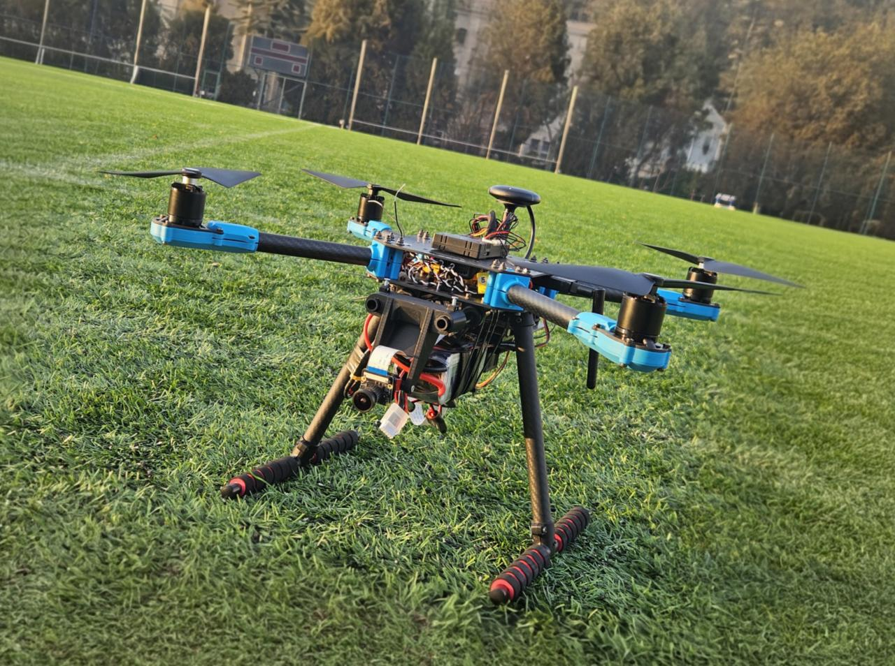

<div align="center">

# AI-Powered UAV System for Rapid Human Detection in Search & Rescue

**Real-time onboard human detection · Jetson Nano · YOLOv11n · TensorRT · DeepStream/RTSP deployment workflow**

[](https://python.org)
[](https://github.com/ultralytics/ultralytics)
[](https://developer.nvidia.com/embedded/jetson-nano)
[](https://developer.nvidia.com/tensorrt)
[](LICENSE)
[](https://gazi.edu.tr)

</div>

---

> **Bachelor's thesis project** — Gazi University, Faculty of Technology, Department of Electrical & Electronics Engineering (January 2026).  
> **Authors:** Muhammed Ali Yıldırım  
> **Advisor:** Assoc. Prof. Dr. Ayşe Demirhan

---

## Demo

<div align="center">

| Hardware — Holybro X500 V2 on the field | Live detection — Gazi University campus |
|:---:|:---:|
|  |  |

*Real UAV field footage — YOLOv11n detecting humans at varying altitudes with bounding boxes and confidence scores streamed to the ground station.*

</div>

---

## Overview

This repository presents an **end-to-end UAV-based real-time human detection system** designed for search-and-rescue (SAR) scenarios. The system uses an onboard IMX477 camera and an NVIDIA Jetson Nano edge device to process aerial video, detect the `human` class with YOLO-based models, and provide annotated video to the ground control station for operator monitoring.

The key design principle is **operator decision support**: the AI pipeline detects candidate human targets, while the human operator performs the final confirmation. Autonomous flight control and automatic target-following are intentionally outside the scope of this work.

### What makes this project different

- **Full hardware-software integration** from UAV platform assembly to AI-assisted ground-station monitoring
- **Domain-specific PROJECT dataset** curated from public SARD and WiSARD sources for aerial SAR conditions
- **YOLOv8n vs YOLOv11n comparison** under consistent data splits and evaluation settings
- **Real UAV field validation** at Gazi University campus under different altitude and partial-visibility conditions
- **Edge-AI deployment workflow** targeting Jetson Nano, TensorRT FP16 optimization, DeepStream, and RTSP-based monitoring

---

## System Architecture

```text
IMX477 Camera
     │
     ▼
Jetson Nano (onboard edge AI)
  ├─ Frame acquisition
  ├─ YOLOv11n human detector
  ├─ TensorRT FP16 optimized inference workflow
  ├─ Bounding-box and confidence-score overlay
  └─ RTSP-based video output workflow
     │
     ▼  (Wi-Fi / local network)
Ground Control Station
  ├─ Live annotated video monitoring
  └─ QGroundControl for flight telemetry

Flight control: Pixhawk 6C ← RC operator (fully manual)
AI system: independent perception subsystem with no flight-control authority
```

The AI and flight-control subsystems are **deliberately decoupled**. The Jetson Nano is used as an independent perception and streaming unit; it does not send control commands to the Pixhawk. This separation prevents the detection pipeline from compromising flight safety.

---

## Hardware

| Component | Specification |
|---|---|
| Frame | Holybro X500 V2 quadcopter platform |
| Flight controller | Pixhawk 6C + PX4 firmware |
| Motors | Holybro 2216 KV920 brushless DC motors (×4, CW/CCW configuration) |
| ESCs | BLHeli_S 20A ESCs (×4) |
| Edge compute | NVIDIA Jetson Nano 4GB |
| Camera | IMX477-160 camera module, 12.3 MP, 160° diagonal FOV |
| Battery | 14.8 V 4S LiPo, 8000 mAh, 65C |
| Power regulation | Dedicated 5A UBEC for Jetson Nano |
| GPS | Holybro M10 GPS module |
| RC system | FrSky Taranis QX7 ACCESS transmitter + FrSky XM+ receiver |
| GCS software | QGroundControl |

---

## Results

### PROJECT Dataset — Final Model Comparison

The PROJECT dataset was constructed by combining and curating samples from the public **SARD** and **WiSARD** datasets. SARD was used as a task-focused aerial human detection dataset, while RGB-only WiSARD samples were selectively included to improve environmental diversity, including forested backgrounds, partial occlusion, scale variation, and complex terrain.

| Split | Images |
|---|---:|
| Train | 13,856 |
| Validation | 3,959 |
| Test | 1,979 |
| **Total** | **19,794** |

| Model | Precision | Recall | mAP@0.5 | mAP@0.5:0.95 |
|---|---:|---:|---:|---:|
| YOLOv8n | 0.8997 | 0.7953 | 0.8433 | 0.4013 |
| **YOLOv11n** | **0.9109** | **0.8065** | **0.8694** | **0.4481** |

YOLOv11n outperformed YOLOv8n across the reported PROJECT dataset metrics. The largest gain was observed in mAP@0.5:0.95, where YOLOv11n improved from `0.4013` to `0.4481` (`+0.0468` absolute points, approximately `+11.7%` relative improvement), indicating better bounding-box localization under stricter IoU thresholds.

### Full benchmark across datasets and configurations

<details>
<summary>Click to expand — SARD, WiSARD, PROJECT × YOLOv8/YOLOv11 × Aug/No-Aug</summary>

| Dataset | Model | Aug. | Precision | Recall | mAP@0.5 | mAP@0.5:0.95 |
|---|---|---|---:|---:|---:|---:|
| SARD | YOLOv8n | No | 0.931 | 0.928 | 0.945 | 0.659 |
| SARD | YOLOv8n | Yes | 0.933 | 0.927 | 0.947 | 0.660 |
| SARD | YOLOv11n | No | 0.910 | 0.920 | 0.941 | 0.640 |
| SARD | YOLOv11n | Yes | 0.926 | 0.932 | 0.949 | 0.660 |
| WiSARD | YOLOv8n | No | 0.933 | 0.834 | 0.871 | 0.464 |
| WiSARD | YOLOv8n | Yes | 0.939 | 0.845 | 0.880 | 0.478 |
| WiSARD | YOLOv11n | No | 0.917 | 0.849 | 0.871 | 0.466 |
| WiSARD | YOLOv11n | Yes | 0.932 | 0.847 | 0.879 | 0.481 |
| **PROJECT** | **YOLOv8n** | **Yes** | **0.8997** | **0.7953** | **0.8433** | **0.4013** |
| **PROJECT** | **YOLOv11n** | **Yes** | **0.9109** | **0.8065** | **0.8694** | **0.4481** |

</details>

---

## Field Test Results

Field tests were conducted at the Gazi University campus using real UAV footage. The system was evaluated under multiple altitude/distance conditions and partial-visibility scenarios, including cases where the human target occupied a small pixel area or appeared near the image boundary.

<div align="center">

| Detection at medium altitude | Detection with partial visibility |
|:---:|:---:|
|  |  |

</div>

The field tests qualitatively confirmed that the selected YOLOv11n model could detect human targets across different target scales and challenging visibility conditions. The system is intended to support the operator by highlighting candidate targets rather than replacing human confirmation.

---

## Repository Structure

```text
ai-search-and-rescue-drone-system/
│
├── training/
│   ├── train_yolov11n.ipynb         # Main YOLOv11n training notebook (Google Colab)
│   ├── train_yolov8n.ipynb          # YOLOv8n baseline comparison notebook
│   ├── evaluate_models.ipynb        # Evaluation and metric comparison notebook
│   ├── augmentation_pipeline.py     # Albumentations-based augmentation pipeline
│   ├── dataset.yaml                 # YOLO dataset configuration
│   └── requirements.txt
│
├── inference/
│   └── predict_image_video.py       # Local YOLO inference example
│
├── deployment/
│   └── README_deployment.md         # Jetson Nano, TensorRT, DeepStream, and RTSP workflow notes
│
├── models/
│   ├── README.md                    # Model availability and usage notes
│   └── model_card.md                # Final YOLOv11n model metadata and limitations
│
├── dataset/
│   ├── README_dataset.md            # Dataset construction and access policy
│   └── prepare_dataset.py           # Optional merge/clean/split helper script
│
├── assets/
│   ├── hardware/                    # UAV build and hardware integration photos
│   ├── field_test/                  # Real flight detection screenshots
│   ├── results/                     # Training curves, PR curves, confusion matrices
│   └── architecture_diagram.png
│
├── docs/
│   ├── hardware_bom.md              # Bill of materials and hardware notes
│   ├── system_architecture.md       # Hardware/software architecture explanation
│   ├── dataset_preparation.md       # Dataset curation and QC methodology
│   └── field_tests.md               # Field test setup and observations
│
├── README.md
├── CITATION.cff
├── LICENSE
└── .gitignore
```

> Note: This public repository focuses on training/evaluation code, dataset documentation, model metadata, and system-level deployment documentation. Hardware- and Jetson-specific runtime configurations may vary depending on JetPack, DeepStream, TensorRT, camera driver, and network setup.

---

## Quickstart

### 1 — Install dependencies

```bash
pip install ultralytics opencv-python numpy matplotlib albumentations
```

For Jetson Nano deployment, use the JetPack-compatible Python, CUDA, TensorRT, and DeepStream versions provided by the NVIDIA JetPack ecosystem.

### 2 — Run inference on a video or image

Place the trained YOLOv11n weights under `models/weights/` or update the path below.

```python
from ultralytics import YOLO

model = YOLO("models/weights/yolov11n_sar_best.pt")
results = model.predict(
    source="your_video.mp4",
    conf=0.40,
    imgsz=640,
    save=True
)
```

> **Recommended confidence threshold: 0.40–0.45**  
> This range was selected based on confidence-threshold analysis and SAR-specific recall requirements. Higher thresholds may reduce false positives but can increase the risk of missing small or partially visible human targets.

### 3 — Export to ONNX / TensorRT

```python
from ultralytics import YOLO

model = YOLO("models/weights/yolov11n_sar_best.pt")

# ONNX export
model.export(format="onnx", imgsz=640)

# TensorRT FP16 export
# Run this on the target NVIDIA platform whenever possible.
model.export(format="engine", imgsz=640, half=True)
```

### 4 — Training from scratch

Open `training/train_yolov11n.ipynb` in a Google Colab GPU runtime.

A representative Ultralytics training call is shown below. Keep the same split structure when reproducing the reported comparisons.

```python
from ultralytics import YOLO

model = YOLO("yolo11n.pt")

model.train(
    data="training/dataset.yaml",
    epochs=100,
    imgsz=640,
    batch=32,
    optimizer="SGD",
    lr0=0.01,
    lrf=0.01,
    weight_decay=0.0005,
    fliplr=0.5,
)
```

> The final experimental configuration used controlled, train-only augmentation. Validation and test sets were kept unaugmented to preserve unbiased evaluation.

---

## Dataset

### Public sources

| Dataset | Source | Notes |
|---|---|---|
| SARD | Search-and-rescue-oriented aerial human detection dataset | Used as a task-focused human detection source |
| WiSARD | Wilderness Search and Rescue Dataset | RGB-only samples were selected; thermal/LWIR images were excluded |

Please refer to the original dataset pages and licenses before redistribution or commercial use.

### PROJECT Dataset (this work)

The PROJECT dataset is a curated merge of SARD and WiSARD, with the following processing steps:

- **Modality filtering:** thermal/LWIR images were excluded; only RGB images were used.
- **Scenario-based curation:** forest, semi-forest, occlusion, scale variation, and complex background cases were prioritized.
- **Input standardization:** model training used a 640×640 input size; original high-resolution WiSARD RGB images were curated before training to reduce severe small-target information loss.
- **YOLO-format label validation:** image-label pairing, coordinate bounds, class index consistency, invalid boxes, and missing files were checked.
- **Deduplication and quality control:** duplicate or near-duplicate samples and corrupted files were removed.
- **Train-only augmentation:** validation and test splits were kept unaugmented.

The curated PROJECT dataset is not directly distributed in this repository due to dataset licensing and redistribution considerations. It may be shared upon reasonable academic request.

Contact: [muali.yldrm@gmail.com](mailto:muali.yldrm@gmail.com)

---

## Augmentation Policy

The training pipeline used controlled, realistic augmentations through Albumentations. The goal was to improve generalization while avoiding artificial compositions that do not reflect real UAV flight footage.

Used augmentation categories include:

- safe crop / resizing / padding
- mild affine transformations
- horizontal flip
- limited perspective transformation
- brightness and contrast changes
- HSV jitter
- blur, Gaussian noise, and compression artifacts
- coarse dropout for partial-occlusion simulation

The following augmentations were intentionally avoided or limited for SAR realism:

- mosaic-style composite images
- MixUp / CutMix
- aggressive rotation or unrealistic perspective transformations

---

## Software Stack

| Component | Version / Notes |
|---|---|
| Python | 3.10 |
| PyTorch | 2.x with CUDA support in Colab |
| Ultralytics | YOLOv8 / YOLOv11 |
| OpenCV | Video and image processing |
| Albumentations | Train-only augmentation |
| NVIDIA JetPack | JetPack 4.6.x target for Jetson Nano |
| TensorRT | JetPack-compatible TensorRT runtime |
| DeepStream SDK | Jetson-compatible DeepStream workflow |
| GStreamer | Used through the DeepStream video pipeline |
| QGroundControl | Ground-station telemetry and manual flight monitoring |

---

## Jetson Nano Deployment Workflow

The system-level deployment target is an NVIDIA Jetson Nano with an IMX477 CSI camera. The deployment workflow consists of:

1. Capturing frames from the IMX477 camera.
2. Running the trained YOLOv11n model through an optimized TensorRT FP16 inference workflow.
3. Drawing bounding boxes and confidence scores on detected human targets.
4. Streaming the annotated video to the ground station using an RTSP-based workflow.
5. Monitoring flight telemetry independently through QGroundControl.

Platform-specific configuration files are not guaranteed to be portable across JetPack, DeepStream, camera driver, and TensorRT versions. For this reason, this repository documents the deployment workflow and keeps the training/evaluation artifacts separated from device-specific runtime configuration.

---

## Model Availability

The final YOLOv11n `best.pt` weights exist but are not committed directly by default. To reproduce the public examples, place the weights at:

```text
models/weights/yolov11n_sar_best.pt
```

The trained weights can be shared upon reasonable academic request or provided through an external release link if distribution is permitted.

---

## Limitations

- The system detects candidate human targets but does not autonomously control the UAV.
- The model was trained on RGB data only; thermal/LWIR detection is outside the current repository scope.
- Detection performance can degrade under extreme altitude, motion blur, heavy occlusion, severe lighting changes, or very small target pixel area.
- DeepStream and TensorRT deployment may require platform-specific adjustments on Jetson Nano.
- The PROJECT dataset is curated from public sources and is not redistributed directly in this repository.

---

## Future Work

- Add a portable Jetson Nano deployment package with version-pinned DeepStream configuration files.
- Evaluate newer Jetson hardware for higher FPS and lower latency.
- Add thermal or RGB-thermal multimodal detection support.
- Extend the pipeline with geotagged detections and map-based operator alerts.
- Improve small-target performance through tiling, higher input size, or multi-scale inference.

---

## Citation

If you use this work, please cite:

```bibtex
@thesis{yildirim_mohamedhen2026sar,
  title      = {AI-Powered Drone System for Rapid Reconnaissance and Verification in Search and Rescue},
  author     = {Yıldırım, Muhammed Ali and Mohamedhen Vall, Mohamedou},
  year       = {2026},
  month      = {January},
  school     = {Gazi University, Faculty of Technology},
  type       = {Bachelor's Thesis},
  department = {Electrical and Electronics Engineering}
}
```

---

## References

- Sambolek, S. and Ivašić-Kos, M. Automatic person detection in search and rescue operations using deep CNN detectors.
- Broyles, D., Hayner, C. R., and Leung, K. WiSARD: A labeled visual and thermal image dataset for wilderness search and rescue.
- Ultralytics YOLO documentation.
- NVIDIA DeepStream SDK documentation.
- NVIDIA TensorRT documentation.
- PX4 and QGroundControl documentation.

---

## License

This repository is released under the MIT License. See [LICENSE](LICENSE) for details.

## License Notice

The original code and documentation in this repository are released under the MIT License.

This project uses Ultralytics YOLO models and tooling, which are subject to Ultralytics licensing terms. Models trained using Ultralytics YOLO may be subject to AGPL-3.0 or a commercial Ultralytics Enterprise license depending on the use case.

The SARD and WiSARD datasets are not redistributed in this repository and remain subject to their original dataset licenses and terms of use.

The trained model weights are not included in this repository by default and may be shared upon reasonable academic request.
---

<div align="center">

**Muhammed Ali Yıldırım**  
Electrical & Electronics Engineering · Gazi University · 2026  
[muali.yldrm@gmail.com](mailto:muali.yldrm@gmail.com)

<br>

**Co-author:** Mohamedou Mohamedhen Vall

</div>
