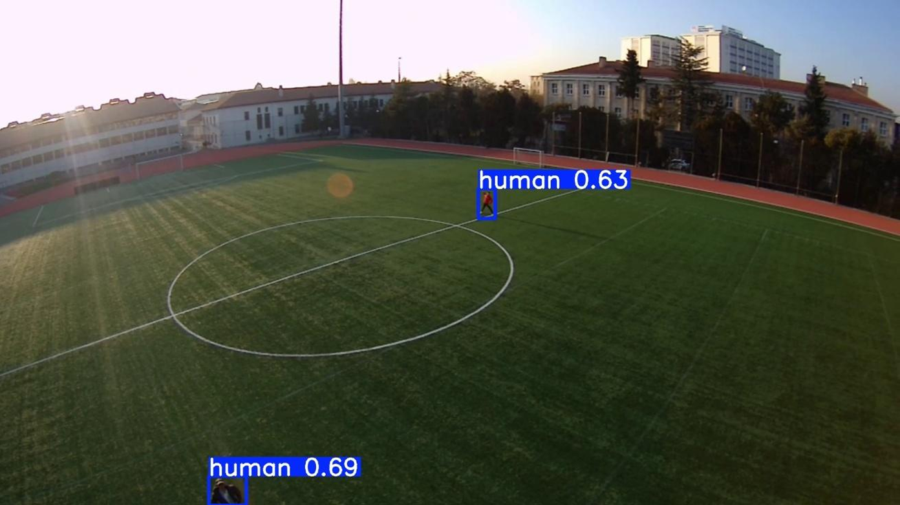
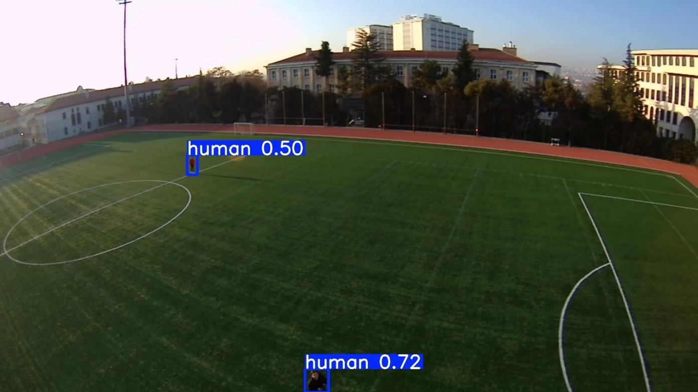

# Field Tests

This document summarizes the field validation process of the AI-powered UAV system for search-and-rescue human detection.

The field tests were conducted using real UAV flight footage. The purpose of these tests was to qualitatively evaluate whether the final YOLOv11n model could detect humans under realistic aerial viewing conditions.

## Test Environment

The field tests were carried out at the Gazi University campus football field.

This location was selected because it provides:

- A wide and open test area
- A safe environment for UAV maneuvering
- Controlled altitude and distance variation
- Suitable conditions for observing human detection performance
- A relatively simple background for initial field validation

## Test Objective

The objective of the field tests was to observe the behavior of the trained model in real UAV footage.

The evaluation focused on:

- Human detection from aerial camera views
- Detection under varying target scales
- Detection at different UAV altitude and distance conditions
- Detection when the target is partially visible
- Detection when the target appears near the edge of the image
- Usability of the annotated video stream for operator monitoring

## Field Test Samples

<div align="center">

| Detection Sample 1 | Detection Sample 2 |
|:---:|:---:|
|  |  |

</div>

## Qualitative Observations

The final YOLOv11n model was able to detect human targets in real UAV footage under different viewing conditions.

The field test samples show that the model can provide useful bounding-box outputs even when:

- The target scale changes due to altitude or distance
- The person appears relatively small in the image
- The target is partially visible
- The person is located near the image boundary

These observations support the practical usability of the system as an operator decision-support tool in UAV-based search-and-rescue scenarios.

## RTSP-Based Monitoring

During the system-level tests, the processed video stream was transmitted to the ground station over RTSP.

The ground station video stream was viewed using:

```text
VLC Player
```

The AI output was used for visual monitoring and operator support. The system did not send any autonomous flight-control commands to the UAV.

## Evaluation Type

The field validation in this repository is qualitative.

Formal numerical measurements for the following were not recorded:

- FPS
- End-to-end latency
- Detection time per frame
- Communication delay

For this reason, this repository does not report numerical FPS or latency values.

## Safety and System Scope

The UAV was manually operated during field tests.

The AI subsystem was used only for perception and visual decision support. It had no direct command authority over the Pixhawk flight controller.

This separation was intentionally maintained to preserve flight safety and to ensure that possible perception errors could not affect UAV control behavior.

## Summary

The field tests demonstrated that the final YOLOv11n model could provide useful human detection outputs in real UAV footage. The results support the feasibility of using the proposed system for rapid reconnaissance and visual confirmation in search-and-rescue-oriented UAV operations.
